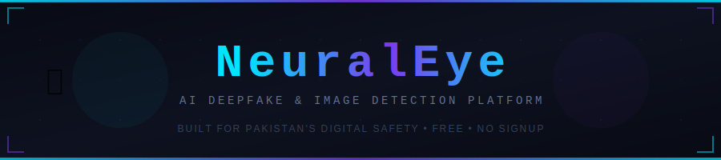

<div align="center">

<!-- Self-hosted animated SVG banner (store banner.svg in your repo root) -->


<br/>

<!-- Typing animation — fixed width & shorter strings -->
<a href="https://abd-abdullah83.github.io/NeuralEye/index.html">

</a>

<br/><br/>

<!-- Badges Row 1 -->


<br/><br/>

<!-- Badges Row 2 -->


<br/><br/>

<!-- Live Demo Button -->
<a href="https://abd-abdullah83.github.io/NeuralEye/index.html">
  
</a>

</div>

---

<div align="center">

### 🖥️ Platform Preview

```
╔══════════════════════════════════════════════════════════════════╗
║   NeuralEye │ AI Detection Platform                   🌙 Dark   ║
╠══════════════╦═══════════════════════════════════════════════════╣
║  🏠 Home     ║                                                   ║
║  🔍 Analyze  ║   ╔═══════════════════════════════════════╗      ║
║  🎬 Video    ║   ║  🤖  AI GENERATED                     ║      ║
║  📰 News     ║   ║  Combined AI Score: 94%               ║      ║
║  💬 Ask AI   ║   ║  ██████████████████████░░  CRITICAL   ║      ║
║  ─────────── ║   ╚═══════════════════════════════════════╝      ║
║  🎓 Learn    ║                                                   ║
║  🕐 Timeline ║   Gemini       ████████████  91%                 ║
║  🤝 Pledge   ║   HuggingFace  ██████████    96%                 ║
║  ⚙️ Settings ║   Sightengine  █████████     94%                 ║
╚══════════════╩═══════════════════════════════════════════════════╝
```

</div>

---

## ⚡ What is NeuralEye?

**NeuralEye** is a **free, fully client-side AI detection platform** built for Pakistan's digital safety. It uses **3 AI engines simultaneously** to detect whether any image or video is real, AI-generated, or a deepfake — in seconds, with no signup required.

> *"96% of deepfakes target non-consenting women. Pakistan has 50M+ WhatsApp users. Misinformation spreads before verification. NeuralEye was built to change that."*

---

## 🏆 Features at a Glance

<div align="center">

| Feature | Description | Status |
|:---:|:---|:---:|
| 🖼️ **Image Analyzer** | Upload any image — 3 AI engines classify it as Real, AI-Generated, or Deepfake | ✅ Live |
| 🎬 **Video Detector** | Extract 8 frames + full temporal analysis via 4 AI models | ✅ Live |
| 📰 **News Checker** | Verify headlines, articles, or screenshots against trusted sources | ✅ Live |
| 💬 **Ask AI** | Chat with Gemini for education, health, science & daily questions | ✅ Live |
| 📊 **Confidence Chart** | Visual bar chart of every AI engine's score per analysis | ✅ Live |
| 🔴 **Threat Meter** | 0–100% danger level if fake content is shared publicly | ✅ Live |
| 📄 **PDF Export** | Full forensics report download in one click | ✅ Live |
| 📱 **WhatsApp Share** | One-tap share of detection result for public awareness | ✅ Live |
| 🔊 **Voice I/O** | Speak your question, hear results read aloud | ✅ Live |
| 🌙 **Dark / Light Mode** | Full theme support with custom accent colors | ✅ Live |
| 🇵🇰 **Urdu Support** | Full RTL Urdu translation across the sidebar and UI | ✅ Live |
| 🤝 **Digital Pledge** | Community commitment to verify-before-sharing | ✅ Live |

</div>

---

## 🧠 How Detection Works

```
┌─────────────────────────────────────────────────────────────┐
│                    YOUR IMAGE / VIDEO                       │
└───────────────────────┬─────────────────────────────────────┘
                        │
           ┌────────────┼────────────┐
           ▼            ▼            ▼
   ┌──────────────┐ ┌──────────┐ ┌─────────────────┐
   │  GEMINI 2.5  │ │HUGGING   │ │  SIGHTENGINE    │
   │  Flash Lite  │ │  FACE    │ │  GenAI Model    │
   │              │ │sdxl-det. │ │                 │
   │ Visual reaso-│ │Binary    │ │ AI probability  │
   │ ning + clues │ │classify  │ │ scoring API     │
   └──────┬───────┘ └────┬─────┘ └───────┬─────────┘
          │              │               │
          └──────────────┼───────────────┘
                         ▼
              ┌────────────────────┐
              │  WEIGHTED AVERAGE  │
              │  COMBINED VERDICT  │
              │  + Threat Level    │
              └────────────────────┘
```

### 🎬 Video Analysis Pipeline

```
Video File
    │
    ├─ Step 1 ──► Extract 8 key frames (browser-side canvas)
    ├─ Step 2 ──► HuggingFace #1: dima806/deepfake_vs_real (per frame)
    ├─ Step 3 ──► HuggingFace #2: Wvolf/ViT-Deepfake-Detection (per frame)
    ├─ Step 4 ──► Gemini 1.5 Flash: Temporal artifacts + facial analysis
    ├─ Step 5 ──► Sightengine: Dedicated deepfake + GenAI video model
    └─ Step 6 ──► Weighted combined score → FINAL VERDICT
```

---

## 🛠️ Tech Stack

<div align="center">

| Layer | Technology |
|:---:|:---|
| 🏗️ **Frontend** | Vanilla HTML5 + CSS3 + JavaScript (ES2022) — zero frameworks |
| 🤖 **AI Engine 1** | Google Gemini 2.5 Flash Lite (image) / Gemini 1.5 Flash (video) |
| 🤗 **AI Engine 2** | HuggingFace Inference API — `Organika/sdxl-detector` |
| 👁️ **AI Engine 3** | Sightengine GenAI + Deepfake models |
| 📊 **Charts** | Chart.js 4.4.0 |
| 📄 **PDF** | jsPDF 2.5.1 + html2canvas 1.4.1 |
| 🗃️ **Storage** | Browser localStorage (zero backend) |
| 🌐 **Hosting** | GitHub Pages |
| 🔡 **Fonts** | Space Mono + DM Sans + Noto Nastaliq Urdu |

</div>

---

## 🚀 Getting Started

### Option A — Use it Instantly (No Setup)
> **[👉 Open NeuralEye Live](https://abd-abdullah83.github.io/NeuralEye/index.html)** — works in any modern browser.

### Option B — Run Locally

```bash
# 1. Clone the repository
git clone https://github.com/Abd-Abdullah83/NeuralEye.git

# 2. Open the file (no server needed)
cd NeuralEye
open index.html
```

### Option C — Fork & Deploy to GitHub Pages

```bash
# 1. Fork this repo on GitHub
# 2. Go to Settings → Pages → Source: main branch / root
# 3. Live at: https://YOUR-USERNAME.github.io/NeuralEye/
```

---

## 🔑 API Keys Setup

NeuralEye requires **free API keys** from 3 providers. Keys are stored **only in your browser**.

<div align="center">

| API | Free Tier | Get Key |
|:---|:---:|:---:|
| **Google Gemini** | ✅ 1M tokens/day | [ai.google.dev](https://ai.google.dev) |
| **HuggingFace** | ✅ Free inference | [huggingface.co/settings/tokens](https://huggingface.co/settings/tokens) |
| **Sightengine** | ✅ 500 ops/month | [sightengine.com](https://sightengine.com) |
| **NewsAPI** *(optional)* | ✅ 100 req/day | [newsapi.org](https://newsapi.org) |
| **JSONBin** *(optional)* | ✅ Free | [jsonbin.io](https://jsonbin.io) |

</div>

Open NeuralEye → **⚙️ Settings & APIs** → paste keys → **💾 Save Keys**

---

## 📸 Core Tabs Explained

<details>
<summary><b>🔍 Image Analyzer</b></summary>

Upload via drag & drop, file browser, or image URL. All 3 engines run in parallel. Results include verdict, threat level, visual clues, explanation, confidence chart. Export as PDF or share card.

</details>

<details>
<summary><b>🎬 Video Deepfake Detector</b></summary>

Supports MP4, WEBM, MOV up to 50MB. Extracts 8 key frames client-side. Runs 4 AI models in sequence. Frame-by-frame grid with individual fake scores. Gemini performs full temporal analysis.

</details>

<details>
<summary><b>📰 News Checker</b></summary>

Input: headline text, article URL, or screenshot. Voice input supported. Verdict: VERIFIED / UNVERIFIED / DISPUTED / MISINFORMATION. Links to trusted Pakistani and international sources.

</details>

<details>
<summary><b>💬 Ask AI</b></summary>

Powered by Gemini 2.5 Flash Lite. Multi-turn conversation (last 10 turns). Topic chips: Education, Health, Science, Tech, Pakistan, Career, Math. Full Markdown rendering in chat bubbles.

</details>

<details>
<summary><b>🎓 Education Hub + 🕐 Timeline</b></summary>

Pakistan-specific context: Elections, WhatsApp crisis, PECA law, audio deepfakes. Key global and Pakistani deepfake incidents from 2017–2025. 6 practical digital safety tips.

</details>

---

## 🇵🇰 Why Pakistan?

```
📊  50M+ WhatsApp users — one of Asia's highest
🗳️  Deepfakes used in 2024 General Election misinformation
🎙️  AI-cloned politician voices used for political attacks
⚖️  PECA 2016 criminalizes digital defamation (up to 3 yrs)
📱  Most forwarded content shared with zero fact-checking
```

---

## 🔒 Privacy

```
✅  No account required          ✅  No data stored on any server
✅  Images sent ONLY to your AI  ✅  All processing in your browser
✅  API keys never leave device   ✅  No analytics or tracking
```

---

## 📁 Repository Structure

```
NeuralEye/
├── index.html      ← Entire application (single-file architecture)
├── banner.svg      ← Animated README banner (self-hosted)
├── logo.png        ← App icon / favicon
├── thumbnail.png   ← OG social preview image
└── README.md       ← You are here
```

---

## 🗺️ Roadmap

- [x] Image deepfake detection (3 engines)
- [x] Video deepfake detection (4 engines)
- [x] News verification with Gemini
- [x] Ask AI chat (multi-turn)
- [x] Urdu language support
- [x] PDF export + Voice I/O
- [ ] Browser extension version
- [ ] Urdu voice recognition
- [ ] Batch image analysis mode
- [ ] Community misinformation database

---

## 🤝 Contributing

```bash
git checkout -b feature/your-feature-name
git commit -m "Add: your feature description"
git push origin feature/your-feature-name
# Then open a Pull Request
```

**Good first contributions:** Urdu translations · Timeline entries · Education content · Accuracy testing

---

## 📜 License

```
MIT License — Free to use, modify, and distribute.
Attribution appreciated but not required.
```

---

<div align="center">

## 👤 Author

**Abdullah** · *BS Data Science · FAST-NUCES Lahore*

<br/>

[](https://github.com/Abd-Abdullah83)
[](https://linkedin.com/in/abdullah-tahir-ds)
[](https://abd-abdullah83.github.io)

<br/>

---

### ⭐ Star this repo if NeuralEye helped you!

<br/>

`NeuralEye v3.0` &nbsp;·&nbsp; `MIT License` &nbsp;·&nbsp; `Built in Pakistan 🇵🇰`

<br/>

*"Verify before you share. Every click matters."*

</div>
